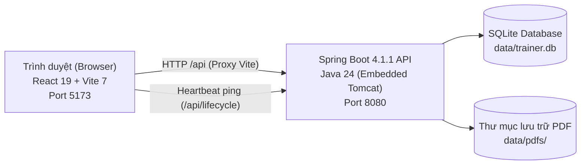

# Marugoto Vocab Trainer (まるごと単語トレーナー)

> **Ứng dụng học và ôn tập từ vựng tiếng Nhật Marugoto chuẩn khoa học với thuật toán FSRS.**  
> **FSRSアルゴリズムを採用した「まるごと」準拠の日本語単語学習・復習アプリケーション。**

---

## 📑 Mục lục / 目次

- [Tiếng Việt](#-tiếng-việt)
  - [1. Giới thiệu tổng quan](#1-giới-thiệu-tổng-quan)
  - [2. Danh sách tính năng thực tế đang có](#2-danh-sách-tính-năng-thực-tế-đang-có)
  - [3. Kiến trúc kỹ thuật & Công nghệ](#3-kiến-trúc-kỹ-thuật--công-nghệ)
  - [4. Cấu trúc thư mục](#4-cấu-trúc-thư-mục)
  - [5. Hướng dẫn cài đặt & Khởi động](#5-hướng-dẫn-cài-đặt--khởi-động)
  - [6. Kiểm thử tự động (Testing)](#6-kiểm-thử-tự-động-testing)
  - [7. Giới hạn & Lưu ý hiện tại](#7-giới-hạn--lưu-ý-hiện-tại)
- [日本語 (Japanese)](#-日本語-japanese)
  - [1. プロジェクト概要](#1-プロジェクト概要)
  - [2. 実装済み機能の詳細一覧](#2-実装済み機能の詳細一覧)
  - [3. アーキテクチャと技術スタック](#3-アーキテクチャと技術スタック)
  - [4. ディレクトリ構成](#4-ディレクトリ構成)
  - [5. インストールおよび起動方法](#5-インストールおよび起動方法)
  - [6. 自動テストの実行](#6-自動テストの実行)
  - [7. 現在の制限事項・留意点](#7-現在の制限事項留意点)

---

# 🇻🇳 Tiếng Việt

## 1. Giới thiệu tổng quan

**Marugoto Vocab Trainer** là ứng dụng web cục bộ (Local Web App) được thiết kế để học, tra cứu và ghi nhớ từ vựng tiếng Nhật trích xuất từ tài liệu PDF của giáo trình **Marugoto** (Starter A1, Elementary A2,...).

Ứng dụng kết hợp giao diện tương tác hiện đại bằng **React 19 + Vite** với backend mạnh mẽ bằng **Java 24 + Spring Boot 4** và cơ sở dữ liệu nhúng **SQLite**. Toàn bộ tiến trình học tập được quản lý theo mô hình lặp lại ngắt quãng chuẩn khoa học **FSRS (Free Spaced Repetition Scheduler)**.

---

## 2. Danh sách tính năng thực tế đang có

### 2.1. Nhập liệu & Trích xuất từ vựng từ PDF (Smart PDF Import)
- **Trích xuất phía Client an toàn (Client-side PDF Extraction)**: Sử dụng thư viện `pdfjs-dist` xử lý trực tiếp trong trình duyệt; không tải file PDF lên server bên thứ ba hay dùng API ngoại tuyến.
- **Tự động nhận diện cấu trúc tài liệu Marugoto**:
  - Tách cột đôi (Dual-column detection): Cột trái (Tiếng Nhật + Romaji), Cột phải (Nghĩa tiếng Việt).
  - Ghép dòng theo tọa độ `y` (Multi-line row grouping), nhận diện và kết nối các định nghĩa trải dài nhiều dòng.
  - Tự động bỏ qua số trang (ví dụ `1 / 18`) và làm sạch các ký hiệu gạch đầu dòng, dấu chấm tròn (`•`, `–`).
  - Chuẩn hóa Unicode toàn bộ văn bản sang chuẩn `NFKC`.
- **Kiểm tra và xử lý trùng lặp thông minh (Duplicate Detection & Resolution)**:
  - Trước khi lưu vào hệ thống, thuật toán tự động đối chiếu các từ chuẩn bị nhập với toàn bộ kho từ vựng hiện có trong CSDL.
  - Nhận diện trùng khớp chính xác mặt chữ tiếng Nhật hoặc trùng theo cách đọc Kana chuẩn hóa (`canonicalKanaKey`).
  - Cung cấp hộp thoại (Modal) hiển thị chi tiết các từ bị trùng, lý do trùng và cho phép lựa chọn: **Bỏ qua từ trùng** (chỉ nhập từ mới) hoặc **Nhập tất cả**.
- **Lưu trữ & Tải lại file PDF gốc**: File PDF sau khi import được lưu trữ nguyên bản trong thư mục `data/pdfs/` trên máy chủ; người dùng có thể bấm nút tải lại file PDF gốc bất cứ khi nào.
- **Quản lý bộ từ vựng (Decks)**: Hiển thị danh sách các bộ từ đã nhập kèm ngày tạo, kích thước file, tổng số từ và số lượng từ đến hạn ôn. Cho phép xóa toàn bộ một bộ thẻ (tự động xóa cascade các thẻ học và file PDF đính kèm).

---

### 2.2. Từ điển tương tác & Tra cứu toàn diện (Interactive Dictionary)
- **Hai chế độ hiển thị**: Chuyển đổi linh hoạt giữa dạng **Bảng danh sách (Table/List)** chi tiết và dạng **Lưới thẻ (Grid/Cards)** trực quan.
- **Tìm kiếm tức thì đa năng (Omni-search)**:
  - Tra cứu cùng lúc trên: Chữ Hán (Kanji), Kana (Hiragana/Katakana), Romaji và Tiếng Việt.
  - Hỗ trợ tiếng Việt không dấu lẫn có dấu (`removeDiacritics`).
  - Tự động **Highlight (làm nổi bật)** từ khóa tìm kiếm trực tiếp trên kết quả.
- **Lọc theo hàng âm 50 chữ cái Gojuon (Gojuon Kana Row Filter)**:
  - Lọc nhanh theo 11 nhóm âm: あ行 (A), か行 (Ka), さ行 (Sa), た行 (Ta), な行 (Na), は行 (Ha), ま行 (Ma), や行 (Ya), ら行 (Ra), わ行 (Wa), và Khác (chữ cái Latin, số, ký hiệu).
- **Lọc theo trạng thái ghi nhớ**:
  - *Tất cả (All)*: Toàn bộ từ vựng trong phạm vi chọn.
  - *Đến hạn ôn (Due)*: Các từ đã đến thời điểm cần ôn theo thuật toán FSRS.
  - *Đang ôn (Reviewed)*: Các từ đã từng học và chưa đến hạn.
  - *Từ mới (New)*: Các từ chưa từng làm bài ôn tập lần nào.
- **Lọc theo bộ thẻ**: Toàn bộ từ vựng, từng bộ PDF riêng lẻ, hoặc riêng bộ từ tùy chỉnh ("custom").
- **Sắp xếp linh hoạt (Sort Orders)**:
  - Theo thứ tự bảng chữ cái tiếng Nhật chuẩn Gojuon (Tăng dần / Giảm dần).
  - Số lần trả lời sai nhiều nhất (*Wrong count* - giúp tập trung xử lý các từ hay nhầm).
  - Số lần ôn tập nhiều nhất (*Review count*).
  - Thời gian thêm gần nhất (*Recent*).
- **Thao tác nhanh trên từng từ**:
  - Bấm nghe phát âm tiếng Nhật chuẩn.
  - Xem và chỉnh sửa chữ Hán (Kanji).
  - Sửa nội dung từ vựng (Nhật, Romaji, Việt).
  - Xóa từ vựng khỏi CSDL.

---

### 2.3. Quản lý & Ánh xạ Hán tự (Kanji Dictionary & Auto-mapping)
- **Từ điển Hán tự tích hợp sẵn (`kanji.js`)**: Kho dữ liệu Kanji phong phú được chuẩn hóa theo các bài học của giáo trình Marugoto A1, A2 và các từ đời sống thường gặp.
- **Tách và phân tích Hán tự + Furigana**: Tự động bóc tách chữ Hán và cách đọc tương ứng trong ngoặc (ví dụ: `魚（さかな）` $\to$ Kanji: `魚`, Reading: `さかな`).
- **Gợi ý chữ Hán 1-1 thông minh (`findKanjiSuggestions`)**:
  - Tự động đề xuất Hán tự phù hợp cho các thẻ chỉ có chữ Kana dựa trên cách phát âm và ngữ nghĩa tiếng Việt tương đồng.
  - Cảnh báo và phân biệt các từ **đồng âm khác nghĩa (Homophones)** nhằm tránh gán nhầm chữ Hán.
- **Gán / Sửa Kanji theo từng từ**: Modal chỉnh sửa cho phép người dùng chọn nhanh từ danh sách gợi ý hoặc tự nhập chữ Hán và cách đọc tùy ý.
- **Tự động quét & Gán chữ Hán hàng loạt (Batch Auto-map Kanji)**:
  - Quét toàn bộ từ điển hoặc các từ đang được lọc.
  - Phân loại rõ ràng: những từ khớp 1-1 chính xác tuyệt đối, những từ có nhiều chữ Hán đồng âm (yêu cầu người dùng tích chọn thủ công), và những từ không có Hán tự tương ứng.
  - Xem trước kết quả trước khi áp dụng; lưu đồng loạt vào backend thông qua API `PUT /api/decks/cards/batch`.
- **Ba chế độ hiển thị Hán tự linh hoạt trong học tập**:
  1. `Ruby (Mặc định)`: Hiện chữ Hán kèm cách đọc Furigana trong ngoặc (`魚（さかな）`).
  2. `Kanji-only`: Chỉ hiện chữ Hán, ẩn hoàn toàn cách đọc Kana để thử thách khả năng ghi nhớ.
  3. `Kana-only`: Chỉ hiện chữ Kana nguyên bản cho người mới bắt đầu.

---

### 2.4. Bộ từ vựng tùy chỉnh (Custom Vocabulary Deck)
- Thêm từ mới thủ công bất kỳ lúc nào với form nhập: Tiếng Nhật, Romaji, Nghĩa tiếng Việt.
- Tự động khởi tạo thẻ học FSRS tương ứng.
- Hoạt động độc lập hoặc có thể kết hợp cùng các bộ từ PDF trong các bài kiểm tra và buổi ôn tập.

---

### 2.5. Phát âm âm thanh bản xứ (Text-to-Speech / Audio)
- Tích hợp giọng đọc tiếng Nhật thông qua **Web Speech API (`ja-JP`)** của trình duyệt.
- Nút phát âm trực quan có mặt ở mọi màn hình: Từ điển, Thẻ Flashcards, Bài thi trắc nghiệm (cả câu hỏi và các đáp án), và Màn hình ôn tập.

---

### 2.6. Học thẻ ghi nhớ (Interactive Flashcards)
- **Hiệu ứng lật thẻ 3D mượt mà**:
  - Mặt trước: Tiếng Nhật, Romaji, Nút phát âm.
  - Mặt sau: Nghĩa tiếng Việt, Chữ Hán chi tiết, Thống kê số lần ôn / số lần sai.
- **Đánh giá ghi nhớ trực tiếp theo 4 mức chuẩn FSRS**:
  - `Again` (Đánh giá 1): Quên từ vựng, FSRS xếp lịch học lại ngay.
  - `Hard` (Đánh giá 2): Nhớ nhưng khó khăn.
  - `Good` (Đánh giá 3): Nhớ tốt, đúng nhịp độ.
  - `Easy` (Đánh giá 4): Rất dễ, tăng khoảng cách ôn tập dài hơn.
- **Điều hướng & Phím tắt bàn phím**:
  - Hỗ trợ nút tiến/lùi, chuyển nhanh đến số thẻ bất kỳ.
  - Phím tắt tiện dụng: `Space` (lật thẻ), `1 - 4` (chọn mức FSRS Again / Hard / Good / Easy), mũi tên điều hướng.

---

### 2.7. Bài kiểm tra trắc nghiệm (Quiz / Test Mode)
- **Tạo bài kiểm tra 5 phương án lựa chọn (5-Choice Quiz)**: Tự động trích xuất các đáp án gây nhiễu (distractors) ngẫu nhiên từ kho thẻ đã chọn.
- **Tùy chỉnh linh hoạt chiều câu hỏi**:
  - Tiếng Nhật $\to$ Tiếng Việt.
  - Tiếng Việt $\to$ Tiếng Nhật.
- **Tùy chọn chế độ hiển thị Hán tự**: Cho phép chọn hiển thị dạng Ruby, chỉ hiện Kanji, hoặc chỉ hiện Kana.
- **Chọn số lượng câu hỏi**: Hỗ trợ các nút chọn nhanh (5, 10, 20 câu, Tất cả) hoặc nhập số lượng câu hỏi tùy ý.
- **Chiến lược chọn thẻ thông minh (`selectInitialCards`)**: Ưu tiên bốc các thẻ đã đến hạn ôn trước, sau đó mới bổ sung các thẻ chưa đến hạn để đảm bảo đủ số lượng yêu cầu.
- **Hỗ trợ phím tắt**: Bấm phím số `1 - 5` để chọn đáp án tương ứng, phím `Enter` để xác nhận / chuyển câu tiếp.
- **Phản hồi tức thì**: Báo màu xanh (đúng) hoặc đỏ (sai), hiển thị đáp án đúng kèm nút phát âm.
- **Màn hình tổng kết chi tiết**: Thống kê điểm số, tỷ lệ chính xác ngay lần thử đầu tiên (% First-try Accuracy), danh sách chi tiết các từ đã trả lời đúng và các từ bị sai.

---

### 2.8. Ôn tập khoa học với thuật toán FSRS (Due Review Mode)
- **Tích hợp thư viện chuẩn Java FSRS (`io.github.open-spaced-repetition:fsrs v0.6.0`)**:
  - Tỷ lệ duy trì mục tiêu (*Desired Retention*): **90%**.
  - Các bước học (*Learning steps*): **1 phút, 10 phút**.
  - Bước học lại (*Relearning step*): **10 phút**.
  - Khoảng cách tối đa (*Maximum interval*): **36,500 ngày** (~100 năm).
  - Kích hoạt tính năng *Fuzzing* để phân bổ ngày ôn tránh dồn lịch quá tải vào một ngày.
- **Hàng đợi lặp lại trong phiên học (In-Session Repeat Queue - `quizSession.js`)**:
  - Khi người dùng trả lời sai một từ trong buổi ôn, hệ thống tự động ghi nhận đánh giá `Again` vào CSDL và đưa thẻ vào danh sách chờ (`waiting list`).
  - Sau thời gian chờ quy định (1 phút / 10 phút), thẻ sẽ tự động được trả lại hàng đợi câu hỏi (`repeat queue`) để người dùng ôn lại cho đến khi trả lời đúng mới hoàn thành buổi học.
  - Đồng hồ đếm ngược trực quan hiển thị số giây chờ nếu tạm thời hết câu hỏi mới trong hàng đợi.

---

### 2.9. Khởi động 1-Click & Tự động quản lý vòng đời tiến trình (Auto Lifecycle & 1-Click Launch)
- **Khởi động 1-click không cần dòng lệnh**: File `start-app.cmd` và `launch-app.ps1` hỗ trợ nhấp đúp chuột để chạy.
- **Tự động kiểm tra môi trường**: Kiểm tra sự tồn tại của Java 24 và Node.js; nếu thiếu sẽ hiện hộp thoại thông báo hướng dẫn rõ ràng.
- **Tự động cài đặt dependencies**: Tự động chạy `npm install` nếu thư mục `node_modules` chưa tồn tại.
- **Chạy nền hoàn toàn ẩn (Zero Console Windows)**: Cả Spring Boot backend và Vite frontend dev server đều được khởi động ẩn ở chế độ nền, không làm bung cửa sổ đen dòng lệnh.
- **Tự động mở trình duyệt**: Ngay khi backend và frontend sẵn sàng, trình duyệt mặc định sẽ tự động mở trang `http://localhost:5173`.
- **Cơ chế Watchdog & Heartbeat tự động dọn dẹp (`LifecycleController.java`)**:
  - Frontend gửi tín hiệu heartbeat đều đặn về backend.
  - Khi người dùng đóng tất cả các tab trình duyệt của ứng dụng, backend sẽ tự động phát hiện sau vài giây và tiến hành tắt an toàn (*Graceful Shutdown*).
  - Tự động đóng tiến trình frontend Vite và giải phóng hoàn toàn các port `8080` và `5173`. Người dùng chỉ cần tắt trình duyệt là toàn bộ ứng dụng tự đóng sạch sẽ, không để lại tiến trình rác chạy ngầm.

---

## 3. Kiến trúc kỹ thuật & Công nghệ



| Tầng (Layer) | Công nghệ / Thư viện | Vai trò |
| :--- | :--- | :--- |
| **Frontend** | React 19, Vite 7 | Giao diện người dùng tương tác, SPA, Reactive state |
| **PDF Engine** | `pdfjs-dist` (v6.3) | Phân tích và trích xuất cấu trúc văn bản PDF phía client |
| **Speech** | Web Speech API (`SpeechSynthesis`) | Phát âm tiếng Nhật bản xứ trực tiếp trên trình duyệt |
| **Backend** | Spring Boot 4.1.1, Java 24 | RESTful API, quản lý tệp tin, điều phối tiến trình |
| **Spaced Repetition** | `io.github.open-spaced-repetition:fsrs` | Lập lịch ôn tập ngắt quãng theo thuật toán FSRS khoa học |
| **Database** | SQLite, `sqlite-jdbc`, HikariCP | Lưu trữ bộ từ, thẻ học, nhật ký ôn tập và trạng thái FSRS |
| **Data Migration** | Flyway-style SQL Runner | Tự động khởi tạo và cập nhật cấu trúc bảng dữ liệu |
| **Automation Scripts** | PowerShell (`launch-app.ps1`), Batch (`start-app.cmd`) | Giám sát tiến trình, quản lý vòng đời ứng dụng 1-click |

---

## 4. Cấu trúc thư mục

```text
marugoto-vocab-trainer/
├── backend/
│   ├── src/
│   │   ├── main/
│   │   │   ├── java/vn/marugoto/trainer/
│   │   │   │   ├── VocabTrainerApplication.java  # Khởi chạy Spring Boot & tạo thư mục dữ liệu
│   │   │   │   ├── DeckController.java           # API quản lý bộ từ, tải file, thẻ tùy chỉnh
│   │   │   │   ├── DeckService.java              # Nghiệp vụ xử lý bộ thẻ, lưu file, trùng lặp
│   │   │   │   ├── StudyController.java          # API truy vấn thẻ học & thẻ đến hạn
│   │   │   │   ├── StudyService.java             # Nghiệp vụ truy vấn và lọc thẻ học
│   │   │   │   ├── ReviewController.java         # API ghi nhận kết quả đánh giá thẻ
│   │   │   │   ├── ReviewService.java            # Cập nhật trạng thái FSRS và ghi log ôn tập
│   │   │   │   ├── FsrsScheduler.java            # Khởi tạo và cấu hình bộ lập lịch FSRS
│   │   │   │   ├── LifecycleController.java      # Quản lý heartbeat, watchdog & tự động tắt
│   │   │   │   ├── ApiModels.java                # DTOs và Data Records
│   │   │   │   ├── ApiExceptionHandler.java      # Bắt lỗi toàn cục và chuẩn hóa thông báo API
│   │   │   │   └── DatabaseMigrationRunner.java  # Thực thi script migration CSDL tự động
│   │   │   └── resources/
│   │   │       ├── application.properties        # Cấu hình cổng, đường dẫn CSDL SQLite & PDF
│   │   │       └── db/migration/
│   │   │           └── V1__create_decks_cards_and_reviews.sql # Schema bảng dữ liệu
│   │   └── test/
│   │       └── java/vn/marugoto/trainer/
│   │           └── DeckAndReviewIntegrationTest.java # Kiểm thử tích hợp trọn vẹn API
│   ├── mvnw.cmd / mvnw                           # Maven Wrapper
│   └── pom.xml                                   # Cấu hình dependencies backend (Java 24)
├── src/
│   ├── main.jsx                                  # Toàn bộ giao diện React (Tabs, Modals, Audio...)
│   ├── dictionary.js                             # Logic từ điển, lọc 50 hàng Gojuon, lọc trùng
│   ├── dictionary.test.js                        # Bộ kiểm thử cho dictionary.js
│   ├── kanji.js                                  # Từ điển Kanji Marugoto, gợi ý và phân tích Hán tự
│   ├── kanji.test.js                             # Bộ kiểm thử cho kanji.js
│   ├── quizSession.js                            # Quản lý phiên làm bài test và hàng đợi lặp lại FSRS
│   ├── quizSession.test.js                       # Bộ kiểm thử cho quizSession.js
│   └── styles.css                                # Định kiểu giao diện hiện đại, responsive, hiệu ứng lật thẻ
├── data/                                         # Thư mục chứa CSDL SQLite (trainer.db) và PDFs (tự tạo)
├── index.html                                    # File HTML chính
├── package.json                                  # Cấu hình frontend dependencies (React 19, Vite 7)
├── vite.config.js                                # Cấu hình Vite dev server & proxy /api sang 8080
├── launch-app.ps1                                # PowerShell script chạy ứng dụng nền & giám sát vòng đời
├── start-app.cmd                                 # File kích hoạt 1-click cho người dùng Windows
└── README.md                                     # Tài liệu hướng dẫn sử dụng và giới thiệu dự án
```

---

## 5. Hướng dẫn cài đặt & Khởi động

### 5.1. Yêu cầu môi trường
- **Java**: Phiên bản **Java 24** (đã được cấu hình trong `PATH`).
- **Node.js**: Phiên bản LTS khuyến nghị (Node.js 18+ hoặc 20+ kèm `npm`).

---

### 5.2. Cách 1: Khởi động 1-Click (Khuyến nghị trên Windows)
Chỉ cần nhấp đúp chuột vào file:
```text
start-app.cmd
```
*Script sẽ tự động kiểm tra môi trường, cài đặt thư viện cần thiết, khởi chạy ẩn backend và frontend, sau đó tự động bật trình duyệt `http://localhost:5173`. Khi bạn đóng tab trình duyệt, toàn bộ ứng dụng sẽ tự động tắt an toàn.*

---

### 5.3. Cách 2: Khởi động thủ công qua Terminal

#### Bước 1: Khởi động Spring Boot Backend (Terminal 1)
```powershell
cd backend
.\mvnw.cmd spring-boot:run
```
*(Backend sẽ lắng nghe tại `http://127.0.0.1:8080` và khởi tạo CSDL SQLite tại `backend/data/trainer.db`)*

#### Bước 2: Khởi động Frontend Dev Server (Terminal 2)
```powershell
# Tại thư mục gốc của dự án
npm install
npm run dev
```

Mở trình duyệt truy cập địa chỉ được hiển thị trong terminal (thông thường là `http://localhost:5173`). Vite đã được cấu hình proxy để tự động chuyển tiếp các yêu cầu `/api` sang cổng `8080`.

---

## 6. Kiểm thử tự động (Testing)

Dự án có độ bao phủ kiểm thử cao cho cả frontend và backend:

### Kiểm thử Frontend:
```powershell
npm test
```
*Chạy toàn bộ 18 bài kiểm tra độc lập bằng Node test runner: kiểm tra chuẩn hóa Gojuon, lọc từ điển, phát hiện từ trùng, gợi ý chữ Hán, hàng đợi FSRS lặp lại...*

### Kiểm thử Backend:
```powershell
cd backend
.\mvnw.cmd test
```
*Chạy các bài kiểm thử tích hợp (Spring Boot MockMvc) kiểm tra trọn vẹn luồng tải PDF, trích xuất thẻ, cập nhật thẻ, ghi nhận đánh giá FSRS và xóa bộ thẻ.*

---

## 7. Giới hạn & Lưu ý hiện tại

1. **Định dạng file PDF**: Hệ thống trích xuất văn bản dựa trên lớp ký tự (text layer) của PDF dạng vector/digital. Đối với file PDF scan hoàn toàn bằng hình ảnh chụp, cần phải qua công đoạn OCR trước khi nhập vì ứng dụng hiện tại chưa tích hợp engine OCR hình ảnh nặng.
2. **Chất lượng giọng đọc (TTS)**: Tính năng phát âm dựa trên `window.speechSynthesis` của trình duyệt. Trải nghiệm giọng đọc phụ thuộc vào engine TTS tiếng Nhật có sẵn trên hệ điều hành của bạn (ví dụ: Google Japanese trên Google Chrome hoặc Microsoft Nanami trên Microsoft Edge).
3. **Phạm vi lưu trữ**: Dữ liệu tiến trình học tập được lưu trữ cục bộ trong file SQLite `trainer.db`. Khi muốn sao lưu hoặc chuyển đổi máy tính, bạn chỉ cần sao chép toàn bộ thư mục `data/` (hoặc thư mục được chỉ định bởi biến môi trường `APP_DATA_DIR`).

---
---

# 🇯🇵 日本語 (Japanese)

## 1. プロジェクト概要

**Marugoto Vocab Trainer（まるごと単語トレーナー）** は、国際交流基金の日本語教材「まるごと（Marugoto）」シリーズ（入門 A1、初級 A2など）の語彙PDFファイルから語彙データを抽出し、体系的かつ科学的に暗記・復習するためのローカルWebアプリケーションです。

モダンな **React 19 + Vite** による高速で快適なUIと、**Java 24 + Spring Boot 4** および組み込み **SQLite** による堅牢なバックエンドを統合しています。記憶の定着には、最先端の学術的間隔反復アルゴリズム **FSRS (Free Spaced Repetition Scheduler)** を採用しています。

---

## 2. 実装済み機能の詳細一覧

### 2.1. 高度なPDFインポートと自動解析（Smart PDF Import）
- **安全なクライアントサイド解析**: `pdfjs-dist` を使用し、ブラウザ内で完結してテキスト抽出を行います。外部のOCRサーバーやクラウドサービスにPDFファイルを送信しないため、高速かつプライバシーが守られます。
- **「まるごと」固有レイアウトの自動解析**:
  - 2カラム構造の自動認識: 左カラム（日本語表記・ローマ字）、右カラム（ベトナム語の意味）。
  - Y座標に基づく行結合（Multi-line Grouping）: 複数行にまたがる単語や説明文を正確に1つのエントリーとして結合。
  - ページ番号（例: `1 / 18`）や行頭の記号・ビュレット（`•`, `–` など）の自動除去。
  - Unicode `NFKC` による表記ゆれの正規化。
- **重複単語のスマート検出と解決（Duplicate Detection）**:
  - インポート時に、データベース内の既存単語と自動照合。
  - 日本語表記の完全一致、および読み（かな）の正規化キー（`canonicalKanaKey`）による重複を検知。
  - 重複プレビューモーダルを表示し、「重複をスキップして新規のみインポート」または「すべてインポート」を選択可能。
- **元PDFファイルのバックアップとダウンロード**: アップロードされたPDFはサーバー側の `data/pdfs/` に安全に保管され、いつでもワンクリックで再ダウンロード可能です。
- **単語帳（デッキ）管理**: 作成日時、ファイルサイズ、総単語数、復習期日到来数を一覧表示。不要になったデッキの削除（関連する単語とPDFファイルのカスケード削除）に対応。

---

### 2.2. インタラクティブ単語帳・辞書（Interactive Dictionary）
- **表示切り替え**: 詳細な「リスト表示（テーブル）」と、視覚的な「カード表示（グリッド）」を瞬時に切り替え可能。
- **強力なオムニ検索（Omni-search）**:
  - 漢字、ひらがな／カタカナ、ローマ字、ベトナム語（声調記号の有無を問わず検索可能）に対応。
  - 検索キーワードの一致部分をリアルタイムでハイライト表示。
- **五十音行フィルター（Gojuon Filter）**:
  - あ行、か行、さ行、た行、な行、は行、ま行、や行、ら行、わ行、その他（英数字・記号）の11区分で絞り込み。
- **学習ステータスフィルター**:
  - *すべて (All)*: 全単語。
  - *復習期日 (Due)*: FSRSアルゴリズムにより復習タイミングに達した単語。
  - *学習中 (Reviewed)*: 学習済みで、まだ次回の復習期日に達していない単語。
  - *未学習 (New)*: 一度も復習・テストを行っていない新規単語。
- **デッキ絞り込み**: 全単語帳、指定したPDFデッキ、またはカスタム単語帳のみの絞り込み。
- **多彩なソート（並び替え）**:
  - 五十音順（昇順／降順）。
  - 間違い回数が多い順（苦手な単語を集中的に克服可能）。
  - 復習回数が多い順。
  - 新しく追加された順。
- **クイックアクション**: 音声再生、漢字の割り当て・編集、単語情報の編集、単語の削除。

---

### 2.3. 漢字辞書と自動マッピング（Kanji Management & Auto-mapping）
- **ビルトイン漢字辞書 (`kanji.js`)**: まるごと A1・A2 レベルおよび日常生活の重要語彙に対応した漢字マッピングデータを内蔵。
- **漢字・ふりがなの自動抽出**: `魚（さかな）` のような表記から漢字部分 `魚` と読み `さかな` を正確に抽出・分解。
- **スマート1対1漢字サジェスト (`findKanjiSuggestions`)**:
  - かな表記のみの単語に対し、発音とベトナム語の意味を照合して最適な漢字表記を自動提案。
  - 同音異義語（Homophones）を検出し、誤った漢字の割り当てを防止。
- **単語ごとの漢字編集モーダル**: 提案された漢字候補からワンクリックで選択、または任意の漢字・読みを入力して保存可能。
- **一括漢字マッピング（Batch Auto-map Kanji）**:
  - 辞書全体または絞り込み中の単語をスキャンし、かな単語に漢字を一括割り当て。
  - 完全に1対1で一致する単語、複数の同音異義語候補がある単語、候補のない単語に分類してプレビュー表示。
  - ユーザーの確認後、API (`PUT /api/decks/cards/batch`) を通じて一括更新を実行。
- **3つの漢字表示モード**:
  1. `ルビ表示 (Ruby)`: 漢字にふりがなを併記（例: `魚（さかな）`）。
  2. `漢字のみ (Kanji-only)`: 読みを隠して漢字のみを表示（漢字の読みテストに最適）。
  3. `かなのみ (Kana-only)`: 初学者向けに純粋なかな表記のみを表示。

---

### 2.4. カスタム単語帳（Custom Deck）
- 日本語、ローマ字、ベトナム語の意味を入力して、いつでも手動で新しい単語を追加可能。
- 追加された単語には自動的にFSRS学習ステータスが付与されます。
- PDFから取り込んだ単語とまとめて、あるいはカスタム単語のみを抽出して学習できます。

---

### 2.5. ネイティブ音声読み上げ（Audio / TTS）
- ブラウザ標準の **Web Speech API (`ja-JP`)** を利用した自然な日本語音声読み上げ。
- 辞書画面、フラッシュカードの表・裏面、テスト問題・選択肢、復習画面のすべてに音声ボタンを配置。

---

### 2.6. インタラクティブ・フラッシュカード（Flashcards）
- **滑らかな3Dカードめくりアニメーション**:
  - 表面: 日本語表記、ローマ字、音声再生ボタン。
  - 裏面: ベトナム語の意味、漢字詳細、復習回数・誤答回数の統計。
- **FSRS準拠の4段階評価ボタン**:
  - `Again` (1): 思い出せなかった（復習間隔をリセットし、セッション内で再出題）。
  - `Hard` (2): 思い出すのが難しかった。
  - `Good` (3): 適切に思い出せた（標準的な間隔延長）。
  - `Easy` (4): 簡単に思い出せた（より長い復習間隔を設定）。
- **キーボードショートカット**: `Space` キーでカード反転、数字キー `1 - 4` で評価選択、矢印キーで前後のカードへ移動。

---

### 2.7. 5択テスト機能（Quiz / Test Mode）
- **5択式クイズ**: 選択したデッキのプールから自動的に誤答選択肢（distractors）を抽出して出題。
- **出題方向の選択**:
  - 日本語 $\to$ ベトナム語
  - ベトナム語 $\to$ 日本語
- **漢字出題モード**: ルビ表示、漢字のみ、かなのみから選択可能。
- **問題数の柔軟な設定**: 5問、10問、20問、全問、または任意の数値を指定可能。
- **スマート出題アルゴリズム (`selectInitialCards`)**: 復習期日に達している単語を最優先で出題し、不足分を未到来の単語からランダムに補充。
- **快適な操作性**: キーボードの `1 - 5` キーで回答選択、`Enter` キーで次の問題へ進行。
- **即時ビジュアルフィードバック**: 正解（緑色）／不正解（赤色）の明快な表示、正解単語の音声再生。
- **結果レポート画面**: スコア、一発正解率（% First-try Accuracy）、正解単語および要復習単語のリストを表示。

---

### 2.8. FSRSアルゴリズムによる科学的復習（Due Review Mode）
- **公式 Java ライブラリ採用 (`io.github.open-spaced-repetition:fsrs v0.6.0`)**:
  - 目標記憶保持率 (*Desired Retention*): **90%**
  - 学習ステップ (*Learning steps*): **1分、10分**
  - 再学習ステップ (*Relearning step*): **10分**
  - 最大復習間隔 (*Maximum interval*): **36,500日**（約100年）
  - ファジング (*Fuzzing*): 有効（期日集中を防止）
- **セッション内再出題キュー (`quizSession.js`)**:
  - 復習セッション中に間違えた単語は即座に `Again` として記録され、一時待機リスト（`waiting list`）に入ります。
  - 規定の待機時間（1分または10分）が経過すると自動的に出題キューへ再投入され、正解するまでセッション内で繰り返し復習させます。
  - 待機中の単語がある場合は、画面上に分かりやすい秒数カウントダウンタイマーが表示されます。

---

### 2.9. ワンクリック起動と完全自動ライフサイクル管理（Auto Lifecycle）
- **黒い画面（CUI）不要のワンクリック起動**: `start-app.cmd` または `launch-app.ps1` をダブルクリックするだけ。
- **環境自動チェック**: Java 24 および Node.js のインストール状況を自動検知し、不足している場合は日本語・ベトナム語でダイアログ案内。
- **依存関係の自動構築**: `node_modules` が存在しない場合、バックグラウンドで自動的に `npm install` を実行。
- **完全バックグラウンド実行（WindowStyle: Hidden）**: Spring Boot および Vite dev server の両方を完全に裏側で起動し、煩わしい黒いコマンドプロンプト画面を一切表示させません。
- **ブラウザ自動起動**: サービスが立ち上がると、自動的に既定のブラウザで `http://localhost:5173` を開きます。
- **Watchdog & ハートビートによる自動プロセス終了 (`LifecycleController.java`)**:
  - フロントエンドから定期的にハートビート信号を送信。
  - ブラウザのタブが閉じられると、バックエンドが数秒以内にそれを検知し、安全にシャットダウン（Graceful Shutdown）を実行。
  - ポート `8080` および `5173` を占有しているプロセスを自動的にクリーンアップ。タスクマネージャーを開いて手動でプロセスを終了させる手間が一切不要です。

---

## 3. アーキテクチャと技術スタック

| レイヤー | 採用技術・ライブラリ | 役割・用途 |
| :--- | :--- | :--- |
| **フロントエンド** | React 19, Vite 7 | 高速SPA、リアクティブ状態管理、レスポンシブUI |
| **PDFエンジン** | `pdfjs-dist` (v6.3) | クライアント側でのPDFテキスト抽出とレイアウト解析 |
| **音声合成** | Web Speech API (`SpeechSynthesis`) | ネイティブな日本語発音のリアルタイム読み上げ |
| **バックエンド** | Spring Boot 4.1.1, Java 24 | REST API、ファイル管理、ライフサイクル制御 |
| **記憶間隔スケジューラー** | `io.github.open-spaced-repetition:fsrs` | FSRS (Free Spaced Repetition Scheduler) アルゴリズム |
| **データベース** | SQLite, `sqlite-jdbc`, HikariCP | 単語、デッキ、復習ログ、FSRS状態のローカル永続化 |
| **マイグレーション** | SQL Runner | 起動時のテーブル自動作成・外部キー制約有効化 |
| **自動化スクリプト** | PowerShell, Windows Batch | 環境検証、バックグラウンド起動、プロセス監視 |

---

## 4. ディレクトリ構成

```text
marugoto-vocab-trainer/
├── backend/
│   ├── src/
│   │   ├── main/
│   │   │   ├── java/vn/marugoto/trainer/
│   │   │   │   ├── VocabTrainerApplication.java  # Spring Bootエントリーポイント
│   │   │   │   ├── DeckController.java           # デッキ・カード操作エンドポイント
│   │   │   │   ├── DeckService.java              # デッキ管理・重複検知・PDF保存ロジック
│   │   │   │   ├── StudyController.java          # 学習カード取得エンドポイント
│   │   │   │   ├── StudyService.java             # 期日到来カードおよび学習データ抽出
│   │   │   │   ├── ReviewController.java         # 復習結果送信エンドポイント
│   │   │   │   ├── ReviewService.java            # FSRS計算更新およびログ記録
│   │   │   │   ├── FsrsScheduler.java            # FSRSスケジューラー定義
│   │   │   │   ├── LifecycleController.java      # ハートビート監視と自動終了コントローラー
│   │   │   │   ├── ApiModels.java                # APIリクエスト/レスポンスDTO
│   │   │   │   ├── ApiExceptionHandler.java      # グローバル例外ハンドラー
│   │   │   │   └── DatabaseMigrationRunner.java  # DBマイグレーション実行
│   │   │   └── resources/
│   │   │       ├── application.properties        # SQLite & ストレージパス設定
│   │   │       └── db/migration/
│   │   │           └── V1__create_decks_cards_and_reviews.sql # DBスキーマ定義
│   │   └── test/
│   │       └── java/vn/marugoto/trainer/
│   │           └── DeckAndReviewIntegrationTest.java # バックエンド結合テスト
│   ├── mvnw.cmd / mvnw                           # Mavenラッパー
│   └── pom.xml                                   # バックエンド依存関係設定 (Java 24)
├── src/
│   ├── main.jsx                                  # ReactメインUI（全画面・モーダル・音声統合）
│   ├── dictionary.js                             # 辞書ロジック、五十音判定、重複検知
│   ├── dictionary.test.js                        # 辞書ロジックの単体テスト
│   ├── kanji.js                                  # まるごと漢字辞書、サジェスト、ルビ解析
│   ├── kanji.test.js                             # 漢字ロジックの単体テスト
│   ├── quizSession.js                            # クイズ・復習セッションおよび再出題キュー管理
│   ├── quizSession.test.js                       # セッション管理の単体テスト
│   └── styles.css                                # モダンUIスタイルシート、カード反転アニメーション
├── data/                                         # SQLite DB (trainer.db) と PDF保存先（自動生成）
├── index.html                                    # アプリケーションHTML
├── package.json                                  # フロントエンド依存関係 (React 19, Vite 7)
├── vite.config.js                                # Vite設定および /api プロキシ定義
├── launch-app.ps1                                # 起動・プロセス監視PowerShellスクリプト
├── start-app.cmd                                 # Windows用ワンクリック起動バッチ
└── README.md                                     # 本ドキュメント
```

---

## 5. インストールおよび起動方法

### 5.1. 動作要件
- **Java**: **Java 24**（環境変数 `PATH` に設定されていること）
- **Node.js**: 推奨LTS版（Node.js 18以上、npm同梱）

---

### 5.2. 方法1: ワンクリック起動（Windows推奨）
リポジトリ直下の以下のファイルをダブルクリックします:
```text
start-app.cmd
```
*環境チェック、依存ライブラリの確認、バックエンドとフロントエンドの非表示起動、ブラウザ起動（`http://localhost:5173`）がすべて自動で行われます。ブラウザのタブを閉じると、関連プロセスもすべて自動的に終了します。*

---

### 5.3. 方法2: ターミナルからの手動起動

#### ターミナル 1: バックエンドの起動
```powershell
cd backend
.\mvnw.cmd spring-boot:run
```
*(ポート `8080` でAPIサーバーが起動し、`backend/data/trainer.db` にSQLiteデータベースが作成されます)*

#### ターミナル 2: フロントエンドの起動
```powershell
# プロジェクトのルートディレクトリにて
npm install
npm run dev
```

ターミナルに表示されたURL（通常は `http://localhost:5173`）をブラウザで開きます。

---

## 6. 自動テストの実行

フロントエンド・バックエンド共に包括的な自動テストが用意されています。

### フロントエンドテスト:
```powershell
npm test
```
*Node test runnerにより、五十音ソート、辞書フィルター、重複検知、漢字サジェスト、FSRS再出題キューなど18項目のテストが実行されます。*

### バックエンドテスト:
```powershell
cd backend
.\mvnw.cmd test
```
*Spring Boot MockMvcによるAPI統合テストが実行され、PDFアップロード、単語取得、FSRS復習ログ記録、デッキ削除などの動作が検証されます。*

---

## 7. 現在の制限事項・留意点

1. **PDFファイルの種類**: ベクター／デジタル形式のテキスト層（text layer）を持つPDFにのみ対応しています。画像のみをスキャンしたPDFは、本アプリに取り込む前に外部のOCRソフト等でテキスト化しておく必要があります。
2. **音声読み上げ（TTS）**: ブラウザの `window.speechSynthesis` を利用しているため、発音の明瞭さや声質はお使いのOSにインストールされている日本語音声エンジン（ChromeのGoogle日本語、EdgeのMicrosoft Nanamiなど）に依存します。
3. **データの保存場所**: 学習進捗データはすべてローカルのSQLiteファイル（`trainer.db`）に保存されます。バックアップや環境移行を行う場合は、`data/` ディレクトリ全体をコピーしてください。
