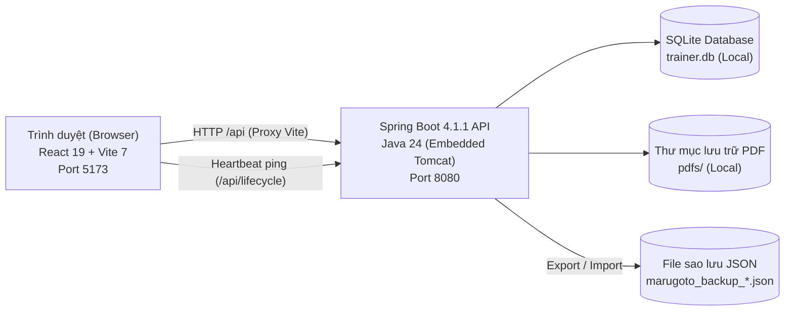

# Marugoto Vocab Trainer (まるごと単語トレーナー)

> **Ứng dụng học và ôn tập từ vựng tiếng Nhật Marugoto chuẩn khoa học với thuật toán FSRS.**  
> **FSRSアルゴリズムを採用した「まるごと」準拠の日本語単語学習・復習アプリケーション。**

---

## 📑 Mục lục / 目次

- [Tiếng Việt](#-tiếng-việt)
  - [1. Giới thiệu tổng quan](#1-giới-thiệu-tổng-quan)
  - [2. Danh sách tính năng thực tế đang có](#2-danh-sách-tính-năng-thực-tế-đang-có)
  - [3. Kiến trúc kỹ thuật & Công nghệ](#3-kiến-trúc-kỹ-thuật--công-nghệ)
  - [4. Cấu trúc thư mục](#4-cấu-trúc-thư-mục)
  - [5. Hướng dẫn cài đặt & Khởi động](#5-hướng-dẫn-cài-đặt--khởi-động)
  - [6. Kiểm thử tự động (Testing)](#6-kiểm-thử-tự-động-testing)
  - [7. Bảo mật CSDL cá nhân & Lưu ý](#7-bảo-mật-csdl-cá-nhân--lưu-ý)
- [日本語 (Japanese)](#-日本語-japanese)
  - [1. プロジェクト概要](#1-プロジェクト概要)
  - [2. 実装済み機能の詳細一覧](#2-実装済み機能の詳細一覧)
  - [3. アーキテクチャと技術スタック](#3-アーキテクチャと技術スタック)
  - [4. ディレクトリ構成](#4-ディレクトリ構成)
  - [5. インストールおよび起動方法](#5-インストールおよび起動方法)
  - [6. 自動テストの実行](#6-自動テストの実行)
  - [7. 個人DBの保護と留意点](#7-個人dbの保護と留意点)

---

# 🇻🇳 Tiếng Việt

## 1. Giới thiệu tổng quan

**Marugoto Vocab Trainer** là ứng dụng web cục bộ (Local Web App) được thiết kế để học, tra cứu và ghi nhớ từ vựng tiếng Nhật trích xuất từ tài liệu PDF của giáo trình **Marugoto** (Starter A1, Elementary A2,...).

Ứng dụng kết hợp giao diện tương tác hiện đại bằng **React 19 + Vite** với backend mạnh mẽ bằng **Java 24 + Spring Boot 4** và cơ sở dữ liệu nhúng **SQLite**. Toàn bộ tiến trình học tập được quản lý theo mô hình lặp lại ngắt quãng chuẩn khoa học **FSRS (Free Spaced Repetition Scheduler)**.

---

## 2. Danh sách tính năng thực tế đang có

### 2.1. Nhập liệu & Trích xuất từ vựng từ PDF (Smart PDF Import)
- **Trích xuất phía Client an toàn (Client-side PDF Extraction)**: Sử dụng thư viện `pdfjs-dist` xử lý trực tiếp trong trình duyệt; không tải file PDF lên server bên thứ ba hay dùng API ngoại tuyến.
- **Tự động nhận diện cấu trúc tài liệu Marugoto**:
  - Tách cột đôi (Dual-column detection): Cột trái (Tiếng Nhật + Romaji), Cột phải (Nghĩa tiếng Việt).
  - Ghép dòng theo tọa độ `y` (Multi-line row grouping), nhận diện và kết nối các định nghĩa trải dài nhiều dòng.
  - Tự động bỏ qua số trang (ví dụ `1 / 18`) và làm sạch các ký hiệu gạch đầu dòng, dấu chấm tròn (`•`, `–`).
  - Chuẩn hóa Unicode toàn bộ văn bản sang chuẩn `NFKC`.
- **Kiểm tra và xử lý trùng lặp thông minh (Homophone-aware Deduplication)**:
  - Tự động đối chiếu các từ chuẩn bị nhập với toàn bộ kho từ vựng hiện có trong CSDL.
  - Nhận diện trùng khớp chính xác mặt chữ tiếng Nhật hoặc trùng theo cách đọc Kana chuẩn hóa (`canonicalKanaKey`).
  - **Phân biệt từ đồng âm khác nghĩa (Homophones)**: Không loại bỏ nhầm các từ có cùng cách đọc kana nhưng khác chữ Hán hoặc khác ngữ nghĩa tiếng Việt (ví dụ: `橋（はし）` - cây cầu vs `箸（はし）` - đôi đũa).
  - Hộp thoại hiển thị chi tiết các từ bị trùng và cho phép lựa chọn: **Bỏ qua từ trùng** (chỉ nhập từ mới) hoặc **Nhập tất cả**.
- **Lưu trữ & Tải lại file PDF gốc**: File PDF sau khi import được lưu trữ nguyên bản trong thư mục `data/pdfs/` trên máy chủ; người dùng có thể bấm nút tải lại file PDF gốc bất cứ khi nào.
- **Quản lý bộ từ vựng (Decks)**: Hiển thị danh sách các bộ từ đã nhập kèm ngày tạo, kích thước file, tổng số từ và số lượng từ đến hạn ôn. Cho phép xóa toàn bộ một bộ thẻ (tự động xóa cascade các thẻ học và file PDF đính kèm).

---

### 2.2. Hai chiều học FSRS độc lập (Dual Study Directions)
- **Hỗ trợ 2 chiều học hoàn chỉnh**:
  - **Nhật $\to$ Việt (`JP_TO_VI`)**: Rèn luyện khả năng nhận biết mặt chữ, phát âm và hiểu nghĩa.
  - **Việt $\to$ Nhật (`VI_TO_JP`)**: Rèn luyện khả năng chủ động gợi nhớ và sản sinh từ vựng.
- **Lưu trữ FSRS riêng biệt cho từng chiều**: Mỗi chiều học có bản ghi thẻ học FSRS độc lập với độ ổn định (`stability`), độ khó (`difficulty`), số lần ôn và ngày đến hạn (`due_at`) riêng. Việc ôn tập tốt ở chiều Nhật $\to$ Việt sẽ không làm thay đổi lịch ôn của chiều Việt $\to$ Nhật, phản ánh chính xác bản chất trí nhớ 2 chiều.
- **Tự động di trú và khởi tạo (Backfill Migration)**: Khi đổi chiều học, hệ thống tự động khởi tạo các thẻ học của chiều tương ứng nếu chưa có.

---

### 2.3. Tự động đánh giá FSRS theo thời gian phản xạ (Auto Rating by Response Time)
- **Đo lường thời gian phản xạ (`responseMs`)**: Ghi nhận chính xác số mili-giây từ khi câu hỏi xuất hiện đến khi người học chọn đáp án.
- **Thanh trượt cấu hình thời gian (Timer Slider)**: Tùy chỉnh linh hoạt giới hạn thời gian từ **3 giây đến 30 giây** (mặc định: 10 giây).
- **Quy tắc phân loại FSRS tự động**:
  - ⚡ **Easy**: Phản xạ cực nhanh ($\le 30\%$ thời gian tối đa và $\le 3.5$ giây).
  - ⏱️ **Good**: Trả lời đúng trong nhịp độ bình thường ($30\% - 75\%$ thời gian).
  - 🐢 **Hard**: Trả lời đúng nhưng tốn nhiều thời gian suy nghĩ ($> 75\%$ thời gian).
  - ⌛ **Again**: Hết giờ mà chưa đưa ra câu trả lời đúng.
- **Cấu hình tiện lợi**: Tính năng tự động lưu điểm phản xạ được **bật mặc định** để người dùng học nhanh không cần bấm phím phụ; người dùng có thể tắt trong cài đặt hoặc bấm phím `1 - 4` để chọn mức đánh giá thủ công theo ý muốn.
- **Tùy chọn tắt timeout khi gặp từ Try Again**: Không đếm ngược khi làm lại từ vừa sai để người học có thời gian quan sát và ghi nhớ kỹ hơn.
- **Thời gian chờ thẻ Again tự chọn**: Trong Kiểm tra và Ôn đến hạn, đặt từ 0 đến 3.600 giây (mặc định 30 giây) tại cấu hình phiên hoặc Cài đặt. Lựa chọn được ghi nhớ trên trình duyệt. Trên màn hình chờ, nhập số giây và bấm **Áp dụng** để đặt lại thời gian chờ của tất cả thẻ đang đợi từ lúc bấm; 0 giây đưa thẻ về hàng đợi ngay. Thời gian chờ trong phiên không phụ thuộc số lần sai và không thay đổi lịch ôn dài hạn FSRS.

---

### 2.4. Chế độ tự gõ câu trả lời (Typed Recall Mode) & Bộ gõ Hiragana tích hợp
- **Tự gõ từ vựng (Typed Recall)**: Thay vì chỉ chọn 1 trong 5 đáp án trắc nghiệm, người học có thể chọn hình thức tự gõ câu trả lời ở cả tab Flashcards và tab Test.
- **Bộ gõ Romaji $\to$ Hiragana tự động**:
  - Gõ Romaji trực tiếp trong ô nhập liệu (ví dụ: `ka` $\to$ `か`, `tsu` $\to$ `つ`, `kitte` $\to$ `きって`, `sensei` $\to$ `せんせい`).
  - Hỗ trợ đầy đủ âm đục (dakuten), bán đục (handakuten), âm ghép (youon) và âm ngắt (sokuon).
- **Thuật toán so khớp câu trả lời thông minh (`checkTypedAnswer`)**:
  - Chấp nhận câu trả lời đúng bằng cả Hiragana, Katakana, Kanji, Romaji hoặc tiếng Việt không dấu.
  - Hiển thị so sánh đáp án chi tiết (Diff feedback) khi người dùng gõ sai để học hỏi ngay lập tức.

---

### 2.5. Nhận diện & Luyện tập chuyên sâu từ khó (Leech / Difficult Cards)
- **Thuật toán nhận diện tự động (`isLeech`)**:
  - Thẻ được tự động đánh dấu là từ khó khi: `wrongCount >= 3` hoặc `reviewCount >= 3` và tỷ lệ sai $\ge 35\%$.
- **Huy hiệu trực quan**: Hiển thị nhãn 🔥 **Từ khó** trên thẻ từ điển, bảng chi tiết và thanh điều hướng Flashcard.
- **Lọc riêng trong Từ điển**: Bộ lọc trạng thái "🔥 Từ khó / Hay quên" cho phép rà soát nhanh tất cả các từ đang gặp khó khăn.
- **Chế độ luyện tập từ khó**:
  - Toggle **🔥 Chỉ luyện từ khó** trong Flashcards, Test và Ôn tập đến hạn giúp tập trung củng cố kiến thức trước các bài thi.

---

### 2.6. Sao lưu & Khôi phục dữ liệu toàn diện (Backup & Restore)
- **Xuất bản sao lưu JSON (Full Export)**: Tải về file `.json` chứa toàn bộ cơ sở dữ liệu: danh sách bộ từ (Decks), từ vựng (Vocabularies), thẻ học FSRS (Study Cards) và toàn bộ lịch sử ôn tập (Review Logs).
- **Khôi phục dữ liệu an toàn (Safe Restore)**:
  - Tải file JSON lên để khôi phục lại dữ liệu trên máy tính khác hoặc sau khi cài lại máy.
  - **Cơ chế bảo vệ dữ liệu dự phòng tự động**: Hệ thống luôn tự động tạo một file CSDL sao lưu `.pre-restore.<timestamp>.bak` trước khi áp dụng khôi phục, đảm bảo không bao giờ bị mất dữ liệu ngoài ý muốn.

---

### 2.7. Tối ưu hóa phát âm tiếng Nhật (Text-to-Speech Optimization)
- **Tự động chọn giọng đọc chuẩn `ja-JP`**: Ưu tiên tìm kiếm các giọng bản xứ chất lượng cao có sẵn trên hệ điều hành (Microsoft Haruka, Ichiro, Ayumi, Google 日本語,...).
- **Làm sạch văn bản phát âm**: Tự động loại bỏ các phần chú thích trong ngoặc, dấu ngã `～`, dấu chấm phân cách `・` để giọng đọc phát âm tròn vành, tự nhiên.

---

### 2.8. Từ điển tương tác & Tra cứu toàn diện (Interactive Dictionary)
- **Hai chế độ hiển thị**: Chuyển đổi linh hoạt giữa dạng **Bảng danh sách (Table/List)** chi tiết và dạng **Lưới thẻ (Grid/Cards)** trực quan.
- **Tìm kiếm tức thì đa năng (Omni-search)**: Tra cứu cùng lúc trên Chữ Hán, Kana, Romaji và Tiếng Việt (có/không dấu) với highlight từ khóa.
- **Lọc theo 11 hàng âm Gojuon (あ行, か行, さ行,...)**.
- **Lọc theo trạng thái**: Tất cả, Đến hạn ôn (Due), Đã ôn (Reviewed), Từ mới (New), và Từ khó (Leech).
- **Sắp xếp linh hoạt**: Theo bảng chữ cái Gojuon (xuôi/ngược), số lần sai nhiều nhất, số lần ôn nhiều nhất, hoặc mới thêm gần đây.

---

### 2.9. Quản lý & Ánh xạ Hán tự (Kanji Dictionary & Auto-mapping)
- **Từ điển Hán tự tích hợp sẵn (`kanji.js`)**: Kho dữ liệu Kanji chuẩn hóa theo các bài học của giáo trình Marugoto A1, A2.
- **Tách và phân tích Hán tự + Furigana**: Tự động bóc tách chữ Hán và cách đọc trong ngoặc (ví dụ: `魚（さかな）`).
- **Gợi ý chữ Hán 1-1 thông minh & Tự động gán hàng loạt (Batch Auto-map Kanji)**: Quét và cập nhật Chữ Hán trực tiếp vào CSDL SQLite nhưng **giữ nguyên 100% tiến độ và lịch sử FSRS** của từng thẻ.
- **Thao tác Gỡ chữ Hán (Flush to Kana)**: Cho phép chuyển nhanh một từ có chữ Hán về thuần Kana trực tiếp trong CSDL khi cần.
- **3 chế độ hiển thị Hán tự**: Ruby (Furigana), Chỉ Chữ Hán (Only Kanji), hoặc Chỉ Kana (Kana-only).

---

### 2.10. Khởi động 1-Click & Tự động tắt ứng dụng (Auto Lifecycle)
- **Khởi động 1-click**: Nhấp đúp `start-app.vbs` để chạy ẩn nền hoàn toàn, không mở cửa sổ console. `start-app.cmd` cũng gọi launcher này nhưng có thể lóe cửa sổ CMD khi nhấp đúp.
- **Tự động mở trình duyệt**: Tự động mở trang `http://localhost:5173`.
- **Heartbeat & Watchdog tự động dọn dẹp**: Khi người dùng đóng tất cả các tab trình duyệt, backend tự động phát hiện và tắt an toàn, tự đóng tiến trình frontend Vite và giải phóng cổng `8080` & `5173`.

---

## 3. Kiến trúc kỹ thuật & Công nghệ



| Tầng (Layer) | Công nghệ / Thư viện | Vai trò |
| :--- | :--- | :--- |
| **Frontend** | React 19, Vite 7 | Giao diện tương tác, SPA, Reactive state, Typed input IME |
| **PDF Engine** | `pdfjs-dist` (v6.3) | Phân tích và trích xuất cấu trúc văn bản PDF phía client |
| **Speech** | Web Speech API (`SpeechSynthesis`) | Phát âm tiếng Nhật bản xứ với cơ chế chọn voice tối ưu |
| **Backend** | Spring Boot 4.1.1, Java 24 | RESTful API, quản lý tệp tin, điều phối tiến trình, Backup/Restore |
| **Spaced Repetition** | `io.github.open-spaced-repetition:fsrs` | Lập lịch ôn tập ngắt quãng 2 chiều theo thuật toán FSRS khoa học |
| **Database** | SQLite, `sqlite-jdbc`, HikariCP | Lưu trữ bộ từ, thẻ học 2 chiều, nhật ký ôn tập và trạng thái FSRS |
| **Data Migration** | Flyway-style SQL Runner | Tự động khởi tạo và cập nhật cấu trúc bảng dữ liệu |
| **Automation Scripts** | VBScript (`start-app.vbs`), PowerShell (`launch-app.ps1`), Batch (`start-app.cmd`) | Giám sát tiến trình, quản lý vòng đời ứng dụng 1-click |

---

## 4. Cấu trúc thư mục

```text
marugoto-vocab-trainer/
├── backend/
│   ├── src/
│   │   ├── main/
│   │   │   ├── java/vn/marugoto/trainer/
│   │   │   │   ├── VocabTrainerApplication.java  # Khởi chạy Spring Boot & cấu hình thư mục
│   │   │   │   ├── DeckController.java           # API quản lý bộ từ, tải file, thẻ tùy chỉnh
│   │   │   │   ├── DeckService.java              # Nghiệp vụ xử lý bộ thẻ, lưu file, trùng lặp
│   │   │   │   ├── StudyController.java          # API truy vấn thẻ học 2 chiều & lọc từ khó
│   │   │   │   ├── StudyService.java             # Nghiệp vụ truy vấn và lọc thẻ học FSRS
│   │   │   │   ├── ReviewController.java         # API ghi nhận kết quả đánh giá thẻ kèm responseMs
│   │   │   │   ├── ReviewService.java            # Cập nhật trạng thái FSRS và ghi nhật ký ôn tập
│   │   │   │   ├── BackupController.java         # API xuất và nhập file sao lưu JSON
│   │   │   │   ├── BackupService.java            # Nghiệp vụ Backup/Restore CSDL kèm pre-restore .bak
│   │   │   │   ├── FsrsScheduler.java            # Khởi tạo và cấu hình bộ lập lịch FSRS
│   │   │   │   ├── LifecycleController.java      # Quản lý heartbeat, watchdog & tự động tắt
│   │   │   │   ├── ApiModels.java                # DTOs, Data Records và tính toán isLeech
│   │   │   │   ├── ApiExceptionHandler.java      # Bắt lỗi toàn cục và chuẩn hóa thông báo API
│   │   │   │   └── DatabaseMigrationRunner.java  # Thực thi script migration CSDL tự động
│   │   │   └── resources/
│   │   │       ├── application.properties        # Cấu hình cổng, đường dẫn CSDL SQLite & PDF
│   │   │       └── db/migration/
│   │   │           └── V1__create_decks_cards_and_reviews.sql # Schema bảng dữ liệu
│   │   └── test/
│   │       └── java/vn/marugoto/trainer/
│   │           └── DeckAndReviewIntegrationTest.java # Kiểm thử tích hợp trọn vẹn API (4 tests)
│   ├── mvnw.cmd / mvnw                           # Maven Wrapper
│   └── pom.xml                                   # Cấu hình dependencies backend (Java 24)
├── src/
│   ├── main.jsx                                  # Toàn bộ giao diện React (Tabs, Modals, Audio, Backup...)
│   ├── dictionary.js                             # Logic từ điển, lọc 50 hàng Gojuon, lọc trùng, isCardLeech
│   ├── dictionary.test.js                        # Bộ kiểm thử cho dictionary.js
│   ├── kanji.js                                  # Từ điển Kanji Marugoto, gợi ý và phân tích Hán tự
│   ├── kanji.test.js                             # Bộ kiểm thử cho kanji.js
│   ├── quizSession.js                            # Quản lý phiên làm bài test và hàng đợi lặp lại FSRS
│   ├── quizSession.test.js                       # Bộ kiểm thử cho quizSession.js
│   ├── api/client.js                             # API client giao tiếp backend (kèm Backup APIs)
│   ├── utils/japaneseInput.js                    # Bộ gõ Romaji -> Hiragana & kiểm tra câu trả lời
│   ├── utils/japaneseInput.test.js               # Bộ kiểm thử cho japaneseInput.js
│   └── styles.css                                # Định kiểu giao diện hiện đại, responsive, hiệu ứng lật thẻ
├── data/                                         # Thư mục chứa CSDL SQLite cục bộ (loại khỏi Git)
├── index.html                                    # File HTML chính
├── package.json                                  # Cấu hình frontend dependencies (React 19, Vite 7)
├── vite.config.js                                # Cấu hình Vite dev server & proxy /api sang 8080
├── launch-app.ps1                                # PowerShell script chạy ứng dụng nền & giám sát vòng đời
├── start-app.vbs                                 # Khởi động ẩn hoàn toàn, không tạo console
├── start-app.cmd                                 # File kích hoạt 1-click cho người dùng Windows
├── .gitignore                                    # Loại bỏ triệt để file CSDL *.db, *.bak, data/ khỏi Git
└── README.md                                     # Tài liệu hướng dẫn sử dụng và giới thiệu dự án
```

---

## 5. Hướng dẫn cài đặt & Khởi động

### 5.1. Yêu cầu môi trường
- **Java**: Phiên bản **Java 24** (đã được cấu hình trong `PATH`).
- **Node.js**: Phiên bản LTS khuyến nghị (Node.js 18+ hoặc 20+ kèm `npm`).

---

### 5.2. Cách 1: Khởi động 1-Click (Khuyến nghị trên Windows)
Chỉ cần nhấp đúp chuột vào file:
```text
start-app.vbs
```
*Script sẽ tự động kiểm tra môi trường, cài đặt thư viện cần thiết, khởi chạy ẩn backend và frontend, sau đó tự động bật trình duyệt `http://localhost:5173`. Khi bạn đóng tab trình duyệt, toàn bộ ứng dụng sẽ tự động tắt an toàn.*

Đóng tab cuối sẽ tắt app sau khoảng 4–6 giây; đóng một tab khi vẫn còn tab khác thì app tiếp tục chạy. Launcher chỉ đọc trạng thái, không gửi heartbeat như một tab. Nếu chưa có tab nào kết nối trong 60 giây sau khi khởi động, launcher cũng tự dọn các tiến trình do nó tạo. Log khởi động nằm trong `marugoto-vocab-trainer/logs/` (`backend.log`, `frontend.log`, và `npm-install.log` nếu cần cài thư viện).

---

### 5.3. Cách 2: Khởi động thủ công qua Terminal

#### Bước 1: Khởi động Spring Boot Backend (Terminal 1)
```powershell
cd backend
.\mvnw.cmd spring-boot:run
```
*(Backend sẽ lắng nghe tại `http://127.0.0.1:8080` và khởi tạo CSDL SQLite tại `backend/data/trainer.db`)*

#### Bước 2: Khởi động Frontend Dev Server (Terminal 2)
```powershell
# Tại thư mục gốc của dự án
npm install
npm run dev
```

Mở trình duyệt truy cập địa chỉ được hiển thị trong terminal (thông thường là `http://localhost:5173`). Vite đã được cấu hình proxy để tự động chuyển tiếp các yêu cầu `/api` sang cổng `8080`.

---

## 6. Kiểm thử tự động (Testing)

Dự án có độ bao phủ kiểm thử cao cho cả frontend và backend:

### Kiểm thử Frontend:
```powershell
npm test
```
*Chạy toàn bộ **26 bài kiểm tra độc lập** bằng Node test runner: kiểm tra chuẩn hóa Gojuon, lọc từ điển, phát hiện từ trùng, bảo toàn từ đồng âm, nhận diện thẻ khó (`isCardLeech`), gợi ý chữ Hán, hàng đợi FSRS lặp lại, bộ gõ Romaji $\to$ Hiragana và thẩm định câu trả lời.*

### Kiểm thử Backend:
```powershell
cd backend
.\mvnw.cmd test
```
*Chạy toàn bộ **4 bài kiểm tra tích hợp** (Spring Boot MockMvc): kiểm tra trọn vẹn luồng tải PDF, trích xuất thẻ 2 chiều, cập nhật thẻ, ghi nhận đánh giá FSRS kèm thời gian phản xạ, xuất/nhập file sao lưu Backup/Restore JSON và lọc thẻ khó.*

---

## 7. Bảo mật CSDL cá nhân & Lưu ý

1. **Bảo mật dữ liệu cá nhân trong Git**: Cấu hình `.gitignore` ở cả thư mục gốc và thư mục backend đã được thiết lập để loại trừ triệt để toàn bộ file cơ sở dữ liệu (`*.db`, `*.db.*`, `*.db-shm`, `*.db-wal`, `*.bak`, `data/`, `pdfs/`). Tiến trình học tập của bạn hoàn toàn riêng tư và không bao giờ bị vô tình đẩy lên Git.
2. **Sao lưu dữ liệu định kỳ**: Sử dụng tính năng **💾 Sao lưu & Khôi phục** trực tiếp trên thanh công cụ của ứng dụng để tải file `.json` lưu vào Google Drive hoặc USB.
3. **Định dạng file PDF**: Hệ thống trích xuất văn bản dựa trên lớp ký tự (text layer) của PDF dạng vector/digital. Đối với file PDF scan hoàn toàn bằng hình ảnh chụp, cần phải qua công đoạn OCR trước khi nhập.
4. **Chất lượng giọng đọc (TTS)**: Ứng dụng đã tự động ưu tiên giọng đọc bản xứ `ja-JP`. Bạn có thể cài thêm các gói giọng nói tiếng Nhật chất lượng cao trong phần cài đặt Speech của Windows để có trải nghiệm tốt nhất.

---
---

# 🇯🇵 日本語 (Japanese)

## 1. プロジェクト概要

**Marugoto Vocab Trainer（まるごと単語トレーナー）** は、国際交流基金の日本語教材「まるごと（Marugoto）」シリーズ（入門 A1、初級 A2など）の語彙PDFファイルから語彙データを抽出し、体系的かつ科学的に暗記・復習するためのローカルWebアプリケーションです。

モダンな **React 19 + Vite** による高速で快適なUIと、**Java 24 + Spring Boot 4** および組み込み **SQLite** による堅牢なバックエンドを統合しています。記憶の定着には、最先端の学術的間隔反復アルゴリズム **FSRS (Free Spaced Repetition Scheduler)** を採用しています。

---

## 2. 実装済み機能の詳細一覧

### 2.1. 高度なPDFインポートと自動解析（Smart PDF Import）
- **安全なクライアントサイド解析**: `pdfjs-dist` を使用し、ブラウザ内で完結してテキスト抽出を行います。外部のOCRサーバーやクラウドサービスにPDFファイルを送信しないため、高速かつプライバシーが守られます。
- **「まるごと」固有レイアウトの自動解析**:
  - 2カラム構造の自動認識: 左カラム（日本語表記・ローマ字）、右カラム（ベトナム語の意味）。
  - Y座標に基づく行結合（Multi-line Grouping）: 複数行にまたがる単語や説明文を正確に結合。
  - ページ番号（例: `1 / 18`）や行頭の記号・ビュレット（`•`, `–` など）の自動除去。
  - Unicode `NFKC` による表記ゆれの正規化。
- **同音異義語を保護するスマート重複検知（Homophone-aware Deduplication）**:
  - インポート時に、既存単語と自動照合。
  - かなの読みが同じでも、漢字表記や意味が異なる同音異義語（例: `橋（はし）` と `箸（はし）`）を誤って重複とみなさず安全に保持。
- **元PDFファイルのバックアップとダウンロード**: アップロードされたPDFはサーバー側の `data/pdfs/` に安全に保管され、いつでも再ダウンロード可能。

---

### 2.2. 双方向独立FSRS学習（Dual Study Directions）
- **「日 $\to$ 越」および「越 $\to$ 日」の完全双方向対応**:
  - 日本語 $\to$ ベトナム語 (`JP_TO_VI`): 受動的認知・語彙理解の定着。
  - ベトナム語 $\to$ 日本語 (`VI_TO_JP`): 能動的想起・発話力と作文力の養成。
- **方向ごとに完全独立したFSRSステータス**: それぞれの方向で個別のカードレコードを持ち、安定度（stability）、難易度（difficulty）、復習期日（due_at）を独立して更新。片方の学習結果がもう一方のスケジュールを狂わせることがありません。

---

### 2.3. 回答時間に基づくFSRS自動評価（Auto Rating by Response Time）
- **Againカードの待機時間を手動設定**: テスト・期限付き復習で0〜3,600秒を指定できます（初期値30秒）。セッション設定または設定画面で保存し、ブラウザに記憶します。待機画面の **Áp dụng** で、待機中の全カードの時間を現在時刻から設定し直せます。0秒なら即座に再出題します。セッション内の待機時間は誤答回数に依存せず、FSRSの長期復習スケジュールを変更しません。
- **回答所要時間（`responseMs`）のミリ秒単位計測**: 問題表示から回答までの時間を精密に測定。
- **制限時間スライダー（3秒 〜 30秒）**: 学習スタイルに応じた制限時間設定。
- **速度に基づく自動判定ルール**:
  - ⚡ **Easy**: 瞬時回答（制限時間の30%以内、かつ3.5秒以内）。
  - ⏱️ **Good**: 標準的なペースでの正解（30%〜75%）。
  - 🐢 **Hard**: 思考時間を要した正解（75%超過）。
  - ⌛ **Again**: タイムアウト（時間切れ）。
- **デフォルトONの快適仕様**: 設定で自動評価を有効にしておくことで、キーボードの数字キーを押すことなくテンポよく高速学習が可能。

---

### 2.4. タイピング回答モード（Typed Recall）＆ かなIME変換内蔵
- **直接タイピングによる回答**: 選択肢を選ぶだけでなく、キーボードから直接スペルを入力して正確なスペリング力を強化。
- **内蔵ローマ字 $\to$ ひらがな変換**:
  - 特別な日本語IMEを起動していなくても、ローマ字入力でリアルタイムにひらがなへ自動変換（濁音・半濁音・拗音・促音 `っ` に完全対応）。
- **柔軟な回答照合ロジック (`checkTypedAnswer`)**: ひらがな、カタカナ、漢字、ローマ字、声調記号なしベトナム語のいずれの入力でも正解判定が可能。

---

### 2.5. 苦手単語（Leech Cards）の自動検出と集中特訓
- **苦手カードの自動判定（`isLeech`）**: 誤答回数が3回以上（`wrongCount >= 3`）、または復習3回以上かつ誤答率35%以上の単語を自動特定。
- **視覚的バッジ**: 辞書およびフラッシュカード上に 🔥 **苦手単語** バッジを表示。
- **辞書フィルター**: 「🔥 苦手単語／要復習」でワンクリック絞り込み。
- **集中テスト機能**: フラッシュカード、テスト、復習モードにおいて「苦手単語のみ」を対象とした集中特訓が可能。

---

### 2.6. 完全バックアップ＆リストア（Backup & Restore）
- **JSON形式でのフルエクスポート**: 単語帳、語彙データ、FSRS学習進捗、復習履歴ログのすべてを単一の `.json` ファイルとして一括保存。
- **安全な復元機能**:
  - 他のPCへのデータ移行や万が一のリカバリが容易。
  - **自動プリリストアバックアップ**: リストア実行直前に、既存DBの `.pre-restore.<timestamp>.bak` ファイルを自動生成するため、データ消失の恐れがありません。

---

### 2.7. ネイティブ日本語音声読み上げの最適化（TTS Voice Selection）
- **`ja-JP` ネイティブ音声の優先選択**: OSに組み込まれている高品質な日本語ボイス（Microsoft Haruka, Ichiro, Google 日本語など）を自動検知して優先適用。
- **読み上げテキストのクレンジング**: 括弧書きの補足や波ダッシュ（`～`）を適切に除去し、自然で明瞭な発音を実現。

---

### 2.8. インタラクティブ単語帳・辞書（Interactive Dictionary）
- **表示切り替え**: リスト（テーブル）表示とグリッド（カード）表示の即時切り替え。
- **強力なオムニ検索**: 漢字・かな・ローマ字・ベトナム語の一括検索とキーワードハイライト。
- **五十音行フィルター**: 11グループによる分類。
- **多彩なソート**: 五十音順、間違い回数順、復習回数順、追加日時順。

---

### 2.9. 漢字辞書と自動マッピング（Kanji Management）
- **ビルトイン漢字辞書 (`kanji.js`)**: まるごと A1・A2 レベルの語彙に対応。
- **FSRS進捗を維持した一括マッピング**: 復習履歴や間隔を100%保持したまま、かな単語に漢字を一括付与。
- **かな戻し（Flush）**: 必要に応じて漢字表記を解除し、純粋なかな表記へワンクリックで戻す機能。
- **3つの漢字表示モード**: ルビ表示、漢字のみ（読みテスト用）、かなのみ。

---

### 2.10. ワンクリック起動と完全自動ライフサイクル管理（Auto Lifecycle）
- **CUI不要のワンクリック起動**: `start-app.vbs` をダブルクリックするだけ。`start-app.cmd` も同じランチャーを呼び出しますが、CMD画面が一瞬表示される場合があります。
- **非表示バックグラウンド起動**: 煩わしい黒いコンソール画面を出さずに静かに立ち上げ。
- **ブラウザタブ連動の自動シャットダウン**: ブラウザを閉じるだけで、ポート `8080` と `5173` のプロセスを自動的かつ安全に完全終了。

---

## 3. アーキテクチャと技術スタック

| レイヤー | 採用技術・ライブラリ | 役割・用途 |
| :--- | :--- | :--- |
| **Frontend** | React 19, Vite 7 | ユーザーインターフェース、SPA、Reactive State、内蔵かなIME |
| **PDF Engine** | `pdfjs-dist` (v6.3) | クライアントサイドでのPDFテキスト抽出・構造解析 |
| **Speech** | Web Speech API (`SpeechSynthesis`) | 最適化された日本語ネイティブ音声合成 |
| **Backend** | Spring Boot 4.1.1, Java 24 | RESTful API、双方向FSRS管理、JSONバックアップ・リストア |
| **Spaced Repetition** | `io.github.open-spaced-repetition:fsrs` | 最先端の科学的間隔反復スケジューラー（双方向独立） |
| **Database** | SQLite, `sqlite-jdbc`, HikariCP | 単語、双方向学習カード、復習ログのローカル永続化 |
| **Data Migration** | Flyway-style SQL Runner | データベーススキーマの自動構築および自動マイグレーション |
| **Automation Scripts** | VBScript (`start-app.vbs`), PowerShell (`launch-app.ps1`), Batch (`start-app.cmd`) | ワンクリック起動およびライフサイクル監視 |

---

## 4. ディレクトリ構成

```text
marugoto-vocab-trainer/
├── backend/
│   ├── src/
│   │   ├── main/java/vn/marugoto/trainer/   # Spring Boot 4 API & FSRSサービス
│   │   └── test/java/vn/marugoto/trainer/   # バックエンド統合テスト（4テスト）
│   ├── mvnw.cmd / mvnw                      # Maven Wrapper
│   └── pom.xml                              # バックエンド設定 (Java 24)
├── src/
│   ├── main.jsx                             # メインUI（React 19）
│   ├── dictionary.js                        # 五十音分類・同音異義語保護・苦手判定
│   ├── kanji.js                             # 漢字辞書・サジェスト・自動マッピング
│   ├── quizSession.js                       # テスト＆FSRSセッション内再出題キュー
│   ├── api/client.js                        # バックエンド通信（バックアップAPI含む）
│   ├── utils/japaneseInput.js               # ローマ字→ひらがな変換＆回答判定
│   └── styles.css                           # UIスタイルシート
├── data/                                    # ローカルSQLite DBとPDF（Git管理外）
├── launch-app.ps1                           # 起動＆監視PowerShellスクリプト
├── start-app.vbs                            # コンソールを作成しない非表示ランチャー
├── start-app.cmd                            # ワンクリック起動バッチファイル
├── .gitignore                               # 個人用DBファイル（*.db, *.bak等）の除外設定
└── README.md                                # 本ドキュメント
```

---

## 5. インストールおよび起動方法

### 5.1. 動作要件
- **Java**: **Java 24**（環境変数 `PATH` に設定されていること）
- **Node.js**: 推奨LTS版（Node.js 18以上、npm同梱）

---

### 5.2. 方法1: ワンクリック起動（Windows推奨）
リポジトリ直下の以下のファイルをダブルクリックします:
```text
start-app.vbs
```
*環境チェック、依存ライブラリの確認、バックエンドとフロントエンドの非表示起動、ブラウザ起動（`http://localhost:5173`）がすべて自動で行われます。ブラウザのタブを閉じると、関連プロセスもすべて自動的に終了します。*

最後のタブを閉じると約4〜6秒で終了します。他のタブが残っていれば動作を続けます。ランチャーは状態を読み取るだけで、タブとしてheartbeatを送信しません。起動後60秒以内に一度もタブが接続しなければ、ランチャーが作成したプロセスも終了します。起動ログは `marugoto-vocab-trainer/logs/` に保存されます。

---

### 5.3. 方法2: ターミナルからの手動起動

#### ターミナル 1: バックエンドの起動
```powershell
cd backend
.\mvnw.cmd spring-boot:run
```
*(ポート `8080` でAPIサーバーが起動し、`backend/data/trainer.db` にSQLiteデータベースが作成されます)*

#### ターミナル 2: フロントエンドの起動
```powershell
# プロジェクトのルートディレクトリにて
npm install
npm run dev
```

ターミナルに表示されたURL（通常は `http://localhost:5173`）をブラウザで開きます。

---

## 6. 自動テストの実行

フロントエンド・バックエンド共に包括的な自動テストが用意されています。

### フロントエンドテスト:
```powershell
npm test
```
*Node test runnerにより、五十音ソート、辞書フィルター、重複検知、同音異義語保護、苦手判定（`isCardLeech`）、漢字サジェスト、FSRS再出題キュー、かなIME変換、回答判定など**全26項目のテスト**が実行されます。*

### バックエンドテスト:
```powershell
cd backend
.\mvnw.cmd test
```
*Spring Boot MockMvcによるAPI統合テストが実行され、PDFアップロード、双方向カード取得、回答時間付きFSRS復習ログ記録、JSONバックアップ・リストア、苦手カード抽出など**全4項目の統合テスト**が検証されます。*

---

## 7. 個人DBの保護と留意点

1. **Gitにおける個人データの除外**: ルートおよびbackendの `.gitignore` により、すべてのデータベースファイル（`*.db`, `*.db.*`, `*.db-shm`, `*.db-wal`, `*.bak`, `data/`, `pdfs/`）が厳格にGitの追跡から除外されています。個人の学習履歴や独自データが誤って公開リポジトリへ流出することはありません。
2. **データの定期バックアップ**: アプリ上部の「💾 **Sao lưu & Khôi phục**」ボタンから、いつでもワンクリックで最新の学習進捗をJSONファイルとして保存可能です。
3. **PDFファイルの種類**: ベクター／デジタル形式のテキスト層を持つPDFに対応しています。
4. **音声読み上げ（TTS）**: ブラウザの `window.speechSynthesis` を利用しており、`ja-JP` ネイティブ音声を自動優先します。
