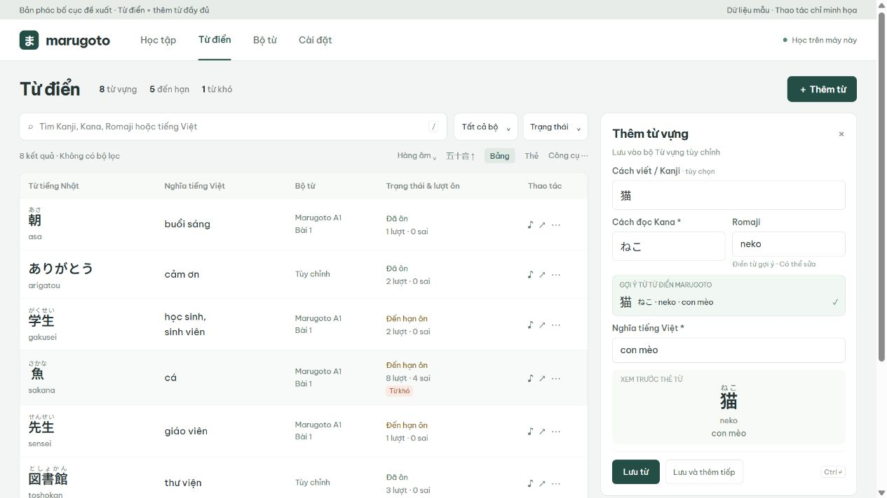

# Kế hoạch overhaul UI/UX — Marugoto Vocab Trainer

Ngày rà soát: 08/10/2026. Trạng thái: đề xuất thiết kế và kế hoạch triển khai; chưa thay đổi giao diện sản phẩm.

Bản phác bố cục: [Từ điển và editor từ vựng](../marugoto-vocab-trainer/docs/redesign-wireframe.html). Đây là mockup tĩnh, các thao tác chỉ minh họa.



## 1. Brief đã chốt

- Thiết bị chính: laptop.
- Hướng thiết kế: công cụ học tập chuyên nghiệp, nhiều thông tin, thao tác nhanh.
- Ưu tiên của người dùng: thêm đầy đủ Kanji/Kana/Romaji ngay lần đầu; tối ưu Từ điển.
- Overhaul toàn bộ ngôn ngữ giao diện và bố cục, giữ tính năng học và dữ liệu hiện có.
- Giữ React 19 + Vite, CSS hiện tại và backend Java/SQLite. Không cần chuyển framework.

Ưu tiên sửa trải nghiệm quản lý từ trước, sau đó đồng bộ màn hình học và các chức năng còn lại. Không cần thêm gamification, tài khoản, cloud sync hay biểu đồ thống kê mới trong đợt này.

## 2. Phạm vi và bằng chứng rà soát

Đã đọc code qua CodeGraph và kiểm tra giao diện hiện tại bằng preview local với 8 từ mẫu, 5 từ đến hạn; preview không kết nối backend thật và chặn thao tác ghi. Đã xem form thêm từ, Từ điển dạng thẻ và bảng tại viewport 1280×720. Chưa kiểm chứng trực quan toàn bộ phiên học, import PDF, restore và các breakpoint khác; các nhận xét ở những phần đó dựa trên code.

| Mức ưu tiên | Vấn đề hiện tại | Bằng chứng | Tác động và hướng sửa |
| --- | --- | --- | --- |
| P1 | Thêm từ không có trường Kana/Romaji riêng | `src/main.jsx:3260`, `:930`: chỉ nhập Nhật/Việt và gửi `romaji: ''` khi tạo | Tạo editor đầy đủ; lưu mọi trường một lần |
| P1 | Sửa nội dung và sửa Hán tự tách thành hai form | `openEditModal`, `openKanjiModal`, `handleSaveKanji` | Dùng một editor cho cả thêm/sửa, có gợi ý và preview |
| P1 | Bộ lọc và header đẩy dữ liệu xuống dưới | Kiểm tra trực quan: ở 1280×720 chưa thấy từ nào trước khi cuộn | Rút header, gom controls, đưa danh sách lên đầu vùng làm việc |
| P1 | Bảng phân bổ diện tích chưa hợp lý | 8 cột; cột FSRS ~211px, tiếng Nhật ~144px trong dữ liệu mẫu | Ưu tiên nội dung Nhật/Việt; gom metadata và bỏ cột lặp |
| P1 | Dạng thẻ có quá nhiều badge/nút trên mỗi từ | `renderDictCard`, chế độ mặc định `cards` | Mặc định bảng trên laptop; giữ chế độ thẻ tùy chọn |
| P2 | Chọn bộ xuất hiện cả global toolbar và Từ điển | `src/main.jsx:1759`, `:1920` | Chọn bộ theo ngữ cảnh từng màn; không để hai bộ chọn cạnh tranh |
| P2 | Import là màn mở đầu dù đã có dữ liệu | `src/main.jsx:253` | Chuyển entry về công việc học; lần đầu chưa có dữ liệu hướng dẫn nhập từ |
| P2 | Flashcards có nhiều nhóm controls cùng cấp | `src/main.jsx:2211–2350` | Giữ thao tác học chính; gom tùy chọn hiển thị vào panel cấu hình |
| P2 | Typed Recall bị phụ thuộc điều kiện đủ 5 lựa chọn | Nav và phần render quiz dùng `hasFiveChoices` | Chỉ áp dụng điều kiện này cho trắc nghiệm; typed vẫn vào được với bộ nhỏ |
| P2 | Alert/confirm mặc định, keyboard và focus thiếu đồng bộ | Các handler Kanji; modal chưa có dialog semantics/focus trap; shortcut học là global | Thông báo inline; dialog có focus; chặn shortcut học khi editor mở |

Điểm hiện tại nên kế thừa: font Be Vietnam Pro/Noto Sans JP phù hợp ngôn ngữ; đã có tìm kiếm không dấu, Furigana, phím tắt, trạng thái lỗi/lưu, lọc từ khó và backup. Không cần thay font hay thêm hiệu ứng chỉ để tạo khác biệt.

## 3. Bố cục tổng thể đề xuất

Điều hướng đầu trang gọn: **Học tập · Từ điển · Bộ từ · Cài đặt**.

- **Học tập:** giữ ba lối vào Flashcards, Test, Ôn đến hạn; hiển thị rõ bộ và chiều đang học.
- **Từ điển:** tra cứu, thêm, sửa, nghe, lọc, gợi ý/gán Kanji.
- **Bộ từ:** bộ PDF, bộ tùy chỉnh, nhập và tải PDF, quản lý bộ.
- **Cài đặt:** tùy chọn mặc định và sao lưu/khôi phục. Vẫn có đường dẫn nhanh tới backup từ Bộ từ.

Không dựng dashboard mới chỉ để chứa số liệu. Màn Học tập có thể mở trực tiếp ôn đến hạn khi có thẻ; khi không có thẻ đến hạn, cho chọn Flashcards/Test. Bộ lọc Từ điển độc lập với bộ học nhưng được ghi nhãn rõ; thao tác “Học bộ này” chuyển phạm vi một cách tường minh.

## 4. Editor từ vựng chung — ưu tiên triển khai đầu tiên

Trên laptop, mở panel bên phải từ nút **Thêm từ** trong Từ điển hoặc Bộ từ. Sửa từ sử dụng cùng component. Khi editor mở, giữ nguyên tìm kiếm, bộ lọc và vị trí danh sách; giảm các cột phụ nếu cần. Không dựng ba cột cố định gây chật ở 1280px. Màn hẹp dùng editor toàn chiều rộng với nút quay lại.

| Trường | Quy tắc đề xuất | Ví dụ |
| --- | --- | --- |
| Cách viết / Kanji | Có thể để trống nếu từ chỉ có Kana; chấp nhận Kanji kèm Okurigana | `食べます` |
| Cách đọc Kana | Bắt buộc cho từ mới trong luồng chuẩn; giữ Hiragana hoặc Katakana người dùng chọn | `たべます` |
| Romaji | Hiển thị và sửa trực tiếp; điền từ gợi ý từ điển khi có; hỗ trợ tự sinh từ Kana ở bước bổ sung | `tabemasu` |
| Nghĩa tiếng Việt | Bắt buộc; giữ dữ liệu người dùng đã nhập | `ăn` |

**Luồng mẫu:** Thêm từ → nhập `ねこ` → thấy gợi ý `猫 · ねこ · neko · con mèo` → chọn gợi ý hoặc điền thủ công → xem preview Furigana → **Lưu** hoặc **Lưu và thêm tiếp**. Không cần vào Từ điển lần thứ hai để bổ sung phiên âm.

Các hành vi phải thiết kế đầy đủ:

- Gợi ý hiển thị Kanji, Kana, Romaji, nghĩa và nguồn. Không tự chọn từ đồng âm khi chưa chắc; ví dụ 橋/箸 cho người dùng lựa chọn.
- Điền gợi ý không ghi đè nội dung người dùng đã sửa mà không có lựa chọn rõ ràng.
- Hỗ trợ dán dữ liệu cũ dạng `魚（さかな）`, tách thành các trường. Cho xem kết quả trước khi lưu.
- Preview đồng bộ với dữ liệu sắp lưu; nghe từ cách đọc Kana khi có.
- Romaji tự sinh phải sửa được. Khi người dùng đã sửa Romaji, đổi Kana không âm thầm ghi đè; hiện lựa chọn tạo lại. Chốt quy tắc trường âm dài, ん, っ và Katakana trước khi triển khai converter.
- Giữ bộ gõ Romaji → Hiragana hiện có; conversion không can thiệp composition của IME. Không ép Katakana về Hiragana trong trường dữ liệu gốc.
- Kiểm tra trùng dùng chính sách đồng âm hiện có, hiển thị từ đã tồn tại ngay trong panel. Không chặn chỉ vì cùng Kana.
- Khi lưu lỗi giữ nguyên bản nháp. Khi “Lưu và thêm tiếp”, reset sau khi server xác nhận thành công và đưa focus về trường đầu.
- Khi đóng bản nháp chưa lưu, hỏi có bỏ thay đổi; đây là hành vi UX của sản phẩm.
- Phím tắt dự kiến: Ctrl/Cmd+Enter để lưu; Tab theo thứ tự trường; Escape đóng nếu không có thay đổi cần xác nhận. Không phát sinh đánh giá FSRS phía sau editor.

**Tương thích dữ liệu:** API đã nhận `{ jp, romaji, vi }`, nên editor có thể ghép cách viết/cách đọc về `jp: '猫（ねこ）'` và gửi `romaji: 'neko'`, `vi: 'con mèo'`. Từ chỉ Kana gửi Kana ở `jp`. Giai đoạn đầu không cần đổi schema. Giữ nguyên `cardId`, liên kết bộ từ, lịch và lịch sử khi sửa; backend `updateCard` hiện chỉ cập nhật nội dung vocabulary.

Không biến tùy chọn “Chỉ Kanji / Chỉ Kana / Furigana” thành thao tác phá mất dữ liệu editor. Đây là cách hiển thị; dữ liệu đầy đủ vẫn được giữ khi lưu. Từ cũ thiếu cách đọc vẫn mở/sửa được, có nhắc bổ sung thay vì ép đoán cách đọc.

## 5. Từ điển như một vùng làm việc

```text
Marugoto       Học tập | Từ điển | Bộ từ | Cài đặt
Từ điển                 Tổng từ · Đến hạn · Từ khó       + Thêm từ
Tìm Nhật / Kana / Romaji / Việt     Bộ từ ▾  Trạng thái ▾  Sắp xếp ▾
Bộ lọc đang dùng ×       Hàng âm ▾        Bảng / Thẻ
─────────────────────────────────────────────────────────────────
Từ tiếng Nhật + cách đọc | Nghĩa | Bộ | Lịch ôn | Lượt/sai | Thao tác
... danh sách ...                         | Editor thêm/sửa khi mở
```

- **Bảng làm mặc định:** từ Nhật/Furigana là thông tin chính; Romaji là dòng phụ có thể ẩn; nghĩa đủ rộng và được xuống dòng. Tăng chiều cao hàng vừa đủ cho Ruby, không cắt chữ Nhật hoặc nghĩa dài.
- **Giảm cột phụ:** hàng âm chuyển vào bộ lọc; số thứ tự không bắt buộc; lượt ôn/sai gọn một nhóm. Chi tiết đầy đủ ở panel xem/sửa từ.
- **Trạng thái rõ:** “Mới”, “Đến hạn”, “Đã ôn”, “Từ khó”; nhãn Mới và Đến hạn có thể cùng đúng, không dùng một badge để thay thế mất thông tin khác. Hiển thị hạn ôn bằng thời gian dễ đọc.
- **Toolbar gọn:** tìm kiếm và bộ lọc chính tối đa hai hàng ở laptop. Hàng âm là dropdown hoặc nhóm mở rộng, không chiếm một khối cao cố định.
- **Thao tác rõ:** nghe và sửa dễ thấy; xóa nằm trong menu thao tác hoặc cuối editor, có xác nhận ghi rõ nội dung bị xóa. Batch Kanji chuyển vào menu công cụ nhưng vẫn có preview và chọn phạm vi.
- **Giữ ngữ cảnh:** lưu bộ lọc/chế độ xem; đóng editor trở lại đúng dòng; từ mới vừa thêm có thông báo và lối tới từ đó nếu nó nằm ngoài bộ lọc hiện tại.
- **Tìm kiếm thống nhất:** tìm Kanji, Kana, Romaji, Việt có/không dấu; highlight cả nội dung Ruby khi khớp. Kết quả rỗng có nút xóa bộ lọc hoặc thêm từ.
- **Quy mô lớn:** đo với 1.000 và 5.000 từ. Chỉ bổ sung phân trang/windowing nếu kết quả đo cho thấy cần; chưa thêm dependency từ đầu.

Mục tiêu nghiệm thu: tại 1280×720 và 1366×768, nhìn thấy ít nhất 5 hàng từ ngay khi mở Từ điển, không cần cuộn; mở editor vẫn nhập/sửa được mà không mất bối cảnh tra cứu. Bản phác đã kiểm tra tại 1280×720: thấy 5 hàng hoàn chỉnh, hàng đầu bảng bắt đầu ở y=250px, nhóm nút lưu nằm trong viewport (đáy y=700px). Đây là kiểm tra mockup, chưa phải kết quả của app sau triển khai.

## 6. Ngôn ngữ thiết kế và màn hình học

**Visual system:** nền xám trung tính rất nhạt, chữ than, một accent xanh đậm cho thao tác chính. Màu trạng thái xanh/đỏ/hổ phách dùng theo ý nghĩa, không dùng mỗi tính năng một màu. Giữ Be Vietnam Pro + Noto Sans JP; cân chỉnh scale, line-height và Ruby trước khi cân nhắc font khác. Body 14–16px; heading 22–28px; số liệu dùng tabular numerals. Spacing theo 4/8px; bớt card lồng card, viền và pill; icon đồng bộ, giữ nhãn dễ hiểu. Không dùng chuyển động gây phân tâm khi học.

**Màn học:** nội dung từ/câu hỏi ở trung tâm; tiến độ, bộ và chiều học gọn ở trên; trả lời/đánh giá và phím tắt ở dưới. Kanji/Romaji/font size nằm trong tùy chọn hiển thị. Setup chia nhóm “Phạm vi”, “Cách trả lời”, “Thời gian & đánh giá”; giữ CTA bắt đầu luôn dễ thấy trên laptop. Giữ nhắc lại từ sai, thời gian chờ và kết quả phiên học hiện có. Typed Recall không bị khóa vì bộ ít từ.

**States và accessibility:** loading, empty, lỗi tải, lỗi lưu, đang lưu, thành công, không có từ đến hạn; dùng thông báo trong ngữ cảnh. Focus-visible thống nhất; dialog có tên, focus trap và trả focus; input có label; hỗ trợ keyboard/IME; trạng thái không chỉ dựa vào màu. Kiểm tra tương phản, zoom 200%, reduced motion và từ Nhật/Việt dài.

## 7. Core feature phải được bảo toàn

| Nhóm | Điều kiện giữ nguyên |
| --- | --- |
| PDF và bộ từ | Nhập nhiều PDF, preview/trùng/đồng âm, PDF gốc, tải/xóa bộ, bộ tùy chỉnh |
| Học | Hai chiều Nhật↔Việt; Flashcards lật/trắc nghiệm/tự gõ; Test; Ôn đến hạn |
| Đánh giá | FSRS, Again/Hard/Good/Easy, tự chấm theo phản xạ, timer và override thủ công |
| Phiên học | Requeue từ sai, chờ ôn lại, kết thúc sớm, lưu kết quả, phím tắt |
| Nhật ngữ | IME Romaji→Kana, chấp nhận đáp án, Furigana/Kanji/Kana, gợi ý/mapping Hán tự |
| Tra cứu | Search không dấu, Gojuon, trạng thái, bộ, sắp xếp, bảng/thẻ, phát âm |
| Dữ liệu | Backup/restore và backup trước restore; giữ ID, liên kết bộ, tiến độ/lịch sử khi sửa |
| Chạy local | SQLite/PDF local, lifecycle heartbeat và quy trình khởi động hiện tại |

Lưu ý baseline: working tree có thay đổi backend chưa commit ở `ReviewService`, `StudyService`, test tích hợp và migration V3. Code hiện tại đồng bộ lịch giữa hai chiều theo vocabulary, khác README còn mô tả lịch độc lập. Lấy code thực tế tại thời điểm bắt đầu triển khai làm baseline và ghi nhận các thay đổi backend đang có; không tự sửa scheduler/migration trong PR giao diện.

## 8. Kế hoạch triển khai theo mốc

| Mốc | Công việc | Kết quả nghiệm thu |
| --- | --- | --- |
| 0 — Chốt bố cục | Review bản phác Từ điển + editor; snapshot baseline core và viewport | Chốt hướng dense/professional và hành vi các trường |
| 1 — Editor & nền tảng | Tạo tokens/CSS primitives; tách editor và adapter dữ liệu; thêm/sửa cùng form, Romaji nhập được, suggestion đầy đủ, preview, trạng thái lưu | Thêm từ đủ 4 trường bằng một lần lưu; sửa không đổi lịch/ID |
| 2 — Từ điển | Bảng mặc định; toolbar gọn; cột và panel chi tiết; lưu ngữ cảnh; công cụ Kanji; search/highlight | Thấy ≥5 hàng ở viewport mục tiêu; giữ tất cả filter/view/action |
| 3 — Shell, Bộ từ, Cài đặt | Điều hướng mới; gom quản lý PDF/custom; backup/restore; empty/loading/error thống nhất | Không mất đường tới tính năng; backup và import vẫn hoạt động |
| 4 — Học tập & hoàn thiện | Setup/focus layout; các chế độ; fix gate typed; keyboard/modal/IME; responsive | Các luồng học cũ hoạt động; typed dùng được với bộ nhỏ |

Mỗi mốc là thay đổi review được; không viết lại `App` và backend cùng một lượt. Tách components theo màn và editor trước, tiếp tục dùng API/client và các utility học hiện có. Kiểm tra feature parity sau mỗi mốc.

**Kiểm chứng khi triển khai:** chạy `npm test` và `npm run build`; test tích hợp Java cho create/update vocabulary và bảo toàn schedule/history; test converter/adapter với Kanji+Kana, Kana-only, Katakana, Okurigana, đồng âm, input cũ và Romaji sửa tay. E2E cho thêm đầy đủ → tìm lại → sửa → học hai chiều; kiểm tra lỗi lưu giữ draft, editor không kích hoạt shortcut học, typed bộ 1–4 từ. Smoke test import PDF/trùng, mapping Kanji và backup/restore bằng DB thử nghiệm. QA trực quan ở 1280×720, 1366×768, 1440×900, 1920×1080 và mobile 390px; không lấy DB học thật làm fixture.

Không có code sản phẩm thay đổi trong đợt audit, nên các kiểm chứng triển khai trên là công việc tương lai, chưa được tuyên bố đã pass.

## 9. Các bổ sung cần tách khỏi overhaul mặc định

- Converter Kana→Romaji là hướng ngược với utility Romaji→Hiragana hiện có: phải triển khai/test riêng; editor có Romaji nhập tay và từ suggestion từ mốc 1 nên không bị chặn bởi converter.
- “Mới thêm gần đây” hiện sort theo ID trong `dictionary.js:258`; để đúng thời gian cần `createdAt` trong DTO. Đây là hạng mục sửa tính đúng dữ liệu nhỏ, cần tách rõ nếu đưa vào scope.
- Chưa cần đổi schema để có trường Kanji/Kana riêng ở UI; nếu muốn lưu structured fields, ví dụ, tag hay phân loại từ thì lập migration và kế hoạch backup riêng.

**Thứ tự đề xuất:** hoàn thiện editor chung → Từ điển → đồng bộ các màn còn lại. Hai mốc đầu giải quyết trực tiếp điểm khó chịu người dùng đã nêu, đồng thời đặt nền cho toàn bộ overhaul.
